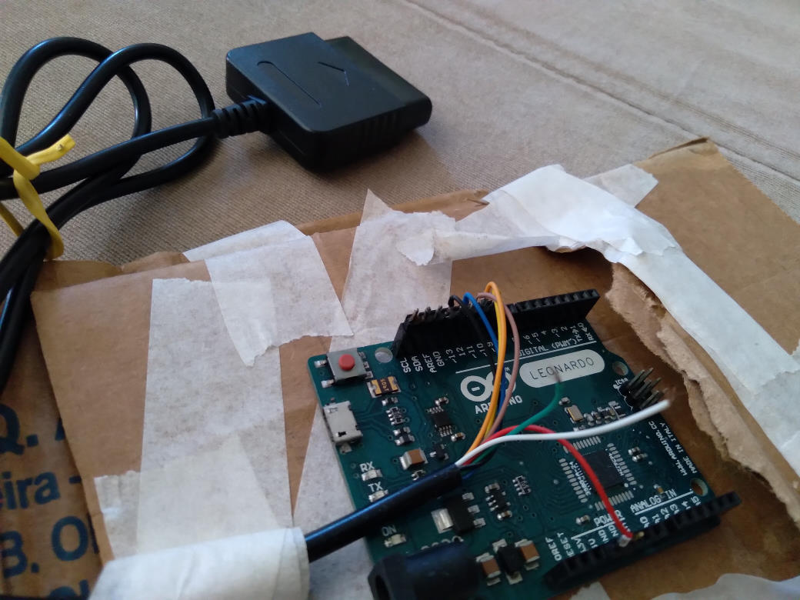

# GunconDuino

PS1 Guncon controller as a Mouse via Arduino Leonardo

This is a work in progress project. It works as it is but I can't provide support.
Use at you own risk.

See it in action
https://www.youtube.com/watch?v=45CCB9uxqrk

Wire the controller directly to the arduino or use this [shield](https://github.com/SukkoPera/PsxControllerShield)

While developing I'm using a psx controller extension cable wired to the arduino

The wires and pins are set in the arduino sketch:

* ATT = 10
* CMD = 11
* DAT = 12
* CLK = 13
* Also connect the 3.3V and GND

Check the ps controller pinout [here](https://store.curiousinventor.com/guides/PS2)

Before using it you will need the library [PsxNewLib](https://github.com/SukkoPera/PsxNewLib).

This only works on a CRT at sd resolutions (15K)

### WARNING
Playstation accessories works with 3.3v.

Arduino sends 5v on it's I/O pins.

I strongly advise to use a level shifter to get the correct voltage. Also use a external voltage regulator and don't use the 3.3v output from the arduino board.

### Usage

When connecting it to a PC it will be in a not enabled state. It will not report any mouse movement.
To enable it simply press the trigger once.
If need to disable it, point the gun outside of the screen and press A + B + Trigger.

The guncon needs to "scan" the entire screen before it can properly send the coorinates.
Just point it at the screen and move slowly from side to side and top to botom.
It's recommended to use a full screen white image when doing this.

Buttons are mapped as follows:
* A (Left side) -> Mouse Right
* B (Right side) -> Mouse Middle
* Trigger -> Mouse Left
 
### Credits
This piece of software would not be possible without the amazing [PsxNewLib](https://github.com/SukkoPera/PsxNewLib).

It also uses a modified version of [absmouse](https://github.com/jonathanedgecombe/absmouse)
