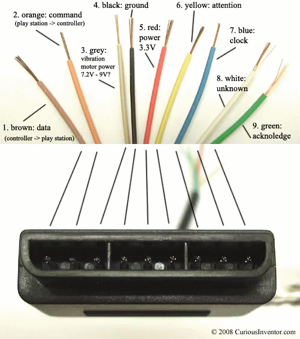
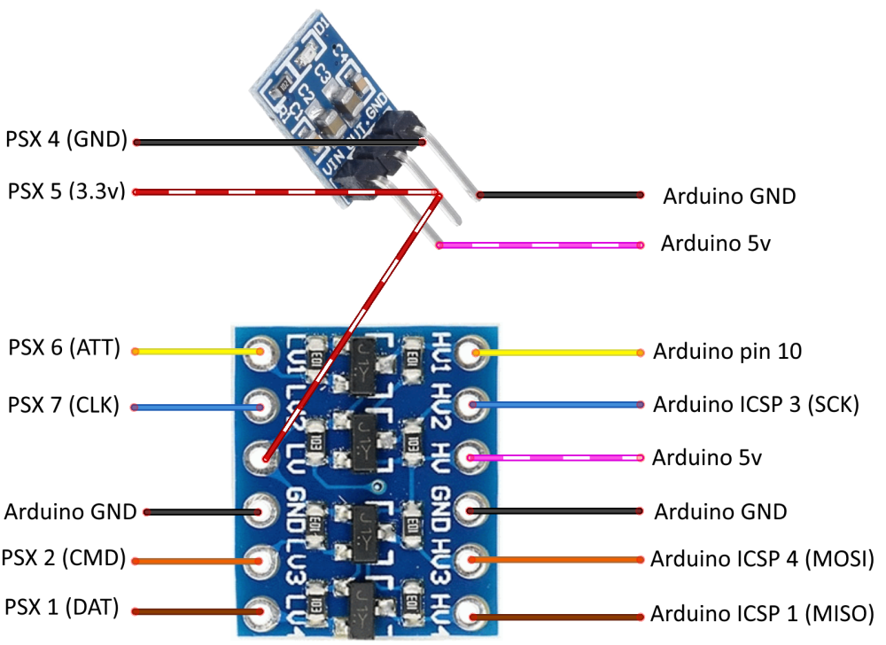
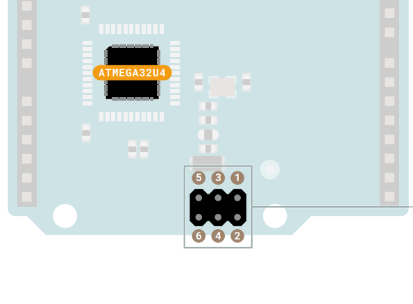

# GunconDuino

PS1 Guncon controller as a Mouse or Joystick via Arduino Leonardo

#### Attention! Project updated on august 2021. It now uses the Leonardo's ICSP header and proper 3.3 volts.

If you want to use the guncon on the [MiSTer](https://github.com/MiSTer-devel/Main_MiSTer/wiki), this code will not work. Check out my other project, the [RetroZordAdapter](https://github.com/sonik-br/RetroZordAdapter/tree/main/PlayStation). It also supports a lot more accessories. 
If you already built a GunconDuino adapter and want to use on MiSTer you can use the new code from RetroZordAdapter. Pins are the same except the ATT pin. Check the documentation before using.

This is a work in progress project. It works as it is but I can't provide support.
Use at you own risk.

See it in action
https://www.youtube.com/watch?v=45CCB9uxqrk

PlayStation accessories works in 3.3v. You will need a voltage regulator and a level shifter.

#### I strongly recommend to use this [shield](https://github.com/SukkoPera/PsxControllerShield)

#### If not using the shield then connect it this way:

Before using it you will need the to install the libraries [PsxNewLib](https://github.com/SukkoPera/PsxNewLib) and [ArduinoJoystickLibrary](https://github.com/MHeironimus/ArduinoJoystickLibrary).

This only works on a CRT at sd resolutions (15K)

It was tested with an oficial namco guncon and with a 3rd party one.
Oficial guncon works perfectly.
With my 3rd party gun the readings are not correct. I still need to try to fix this.

### Usage
The adapter is also compatible with ps1/ps2 dualshock controllers. It's useful to use a controller when mapping the inputs on a emulator, then swap it for the guncon to play.

When connecting it to a PC it will be in a not enabled state. It will not report any mouse or joystick movement.
It's possible to enabe it as a mouse or as a joystick:

| Guncon        | DualShock | Mode     |
| ------------- |---------- | -------- |
| Trigger       | Circle    | Mouse    |
| A (Left side) | Start     | Joystick |

If need to disable it, point the gun outside of the screen and press A + B + Trigger.

The guncon needs to "scan" the entire screen before it can properly send the coorinates.
Just point it at the screen and move slowly from side to side and top to botom.
It's recommended to use a full screen white image when doing this.

Buttons are mapped as follows:

| Guncon         | DualShock | Mouse         | Joystick |
| -------------- | --------- |-------------- | -------- |
| Trigger        | Circle    | Left button   | Button 1 |
| A (Left side)  | Start     | Right button  | Button 2 |
| B (Right side) | Cross     | Middle button | Button 3 |

 
### Credits
This piece of software would not be possible without the amazing [PsxNewLib](https://github.com/SukkoPera/PsxNewLib) by SukkoPera.

It also uses a modified version of [absmouse](https://github.com/jonathanedgecombe/absmouse) by  jonathanedgecombe .

[ArduinoJoystickLibrary](https://github.com/MHeironimus/ArduinoJoystickLibrary) by MHeironimus.

PS controller pinout by [curiousinventor](https://store.curiousinventor.com/guides/PS2).
